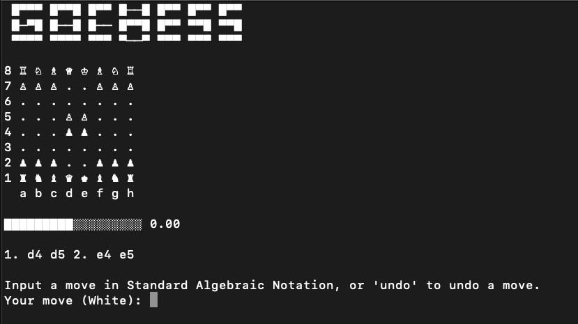

# gochess

A toy chess game playable against human and engine on terminal.

## Usage

```shell
go run cmd/main.go cli

OPTIONS:
   --flip, -f   flip the board at Black's turn (default: false)
   --eval, -e   show the evaluation bar (default: false)
   --white, -w  white will be played by an engine (default: false)
   --black, -b  black will be played by an engine (default: false)
   --help, -h   show help
```

## Interface

A chessboard will be displayed on the terminal. 
If `-e` is specified, an evaluation bar will be shown below it.
The current PGN is also displayed.



When it is your turn, you can input one of the following to the prompt:
- A move in [Standard Algebraic Notation](https://en.wikipedia.org/wiki/Algebraic_notation_(chess))
- `undo`: This will undo a full move (i.e., your opponent's and your move)
